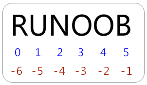

# Python 变量类型

## 变量赋值

```py
#!/usr/bin/python
# -*- coding: UTF-8 -*-
 
counter = 100   # 赋值整型变量
miles = 1000.0  # 浮点型
name = "John"   # 字符串

print(counter, miles)

a = b = c = 1

print(a, b, c)
```

也可以为多个对象指定多个变量。例如：

```py
a, b, c, d = counter, miles, name, True

print(a, b, c, d)
```

## 标准数据类型

Python有五个标准的数据类型

- `Numbers`（数字）
- `String`（字符串）
- `List`（列表）：可变数组
- `Tuple`（元组）：不可变数组
- `Dictionary`（字典）：Map

## Python数字

> 数字数据类型用于存储数值。他们是不可改变的数据类型，这意味着改变数字数据类型会分配一个新的对象。

当你指定一个值时，Number对象就会被创建

```py
var1 = 1
var2 = 10
```

> 您也可以使用 `del` 语句删除一些对象的引用。

del语句的语法是： `del var1[,var2[,var3[....,varN]]]]`

```py
del var
del var_a, var_b
```

- Python支持四种不同的数字类型：

1. int（有符号整型）
2. long（长整型[也可以代表八进制和十六进制]）
3. float（浮点型）
4. complex（复数）

## Python字符串

> 字符串或串(String)是由数字、字母、下划线组成的一串字符。

一般记为 :

```py
s="a1a2···an" # (n>=0)
```

python的字串列表有 `2` 种取值顺序:

- `从左到右` 索引默认0开始的，最大范围是字符串长度少1
- `从右到左` 索引默认-1开始的，最大范围是字符串开头

  

### 字符串截取

**个人理解为下标操作**

> 可以使用 `[头下标:尾下标]` 来截取相应的字符串，其中下标是从 0 开始算起，可以是正数或负数，下标可以为空表示取到头或尾。

> `[头下标:尾下标]` 获取的子字符串 `包含头下标` 的字符，但 `不包含尾下标` 的字符。

```py
s = 'abcdef'

s[1:5]

'bcde'
```

加号（ `+` ）是字符串连接运算符，星号（ `*` ）是重复操作

```py
#!/usr/bin/python
# -*- coding: UTF-8 -*-
 
str = 'Hello World!'
 
print(str)           # 输出完整字符串
print(str[0])        # 输出字符串中的第一个字符
print(str[2:5])      # 输出字符串中第三个至第五个之间的字符串
print(str[2:])       # 输出从第三个字符开始的字符串
print(str * 2)       # 输出字符串两次
print(str + "TEST")  # 输出连接的字符串

# 输出结果

Hello World!
H
llo
llo World!
Hello World!Hello World!
Hello World!TEST
```

## Python列表

List（列表)， 用 `[ ]` 标识，是 python 最通用的复合数据类型，支持`字符`，`数字`，`字符串` 甚至可以包含 `列表`（即嵌套），列表中值的切割也可以用到变量 `[头下标:尾下标]`

```py
#!/usr/bin/python
# -*- coding: UTF-8 -*-
 
list = [ 'runoob', 786 , 2.23, 'john', 70.2 ]
tinylist = [123, 'john']
 
print(list)               # 输出完整列表
print(list[0])            # 输出列表的第一个元素
print(list[1:3])          # 输出第二个至第三个元素 
print(list[2:])           # 输出从第三个开始至列表末尾的所有元素
print(tinylist * 2)       # 输出列表两次
print(list + tinylist)    # 打印组合的列表

# 输出结果

['runoob', 786, 2.23, 'john', 70.2]
runoob
[786, 2.23]
[2.23, 'john', 70.2]
[123, 'john', 123, 'john']
['runoob', 786, 2.23, 'john', 70.2, 123, 'john']
```

## Python元组

> 元组是另一个数据类型，类似于List（列表）  
> 元组用 `()` 标识。内部元素用 `逗号` 隔开。但是 `元组不能二次赋值，相当于只读列表`

```py
#!/usr/bin/python
# -*- coding: UTF-8 -*-
 
tuple = ( 'runoob', 786 , 2.23, 'john', 70.2 )
tinytuple = (123, 'john')
 
print(tuple)               # 输出完整元组
print(tuple[0])            # 输出元组的第一个元素
print(tuple[1:3])          # 输出第二个至第三个的元素 
print(tuple[2:])           # 输出从第三个开始至列表末尾的所有元素
print(tinytuple * 2)       # 输出元组两次
print(tuple + tinytuple)   # 打印组合的元组
```

**个人理解为只读的列表**

如：

```py
#!/usr/bin/python
# -*- coding: UTF-8 -*-
 
tuple = ( 'runoob', 786 , 2.23, 'john', 70.2 )
list = [ 'runoob', 786 , 2.23, 'john', 70.2 ]
tuple[2] = 1000    # 元组中是非法应用
list[2] = 1000     # 列表中是合法应用
```

## Python 字典

> 字典(dictionary)，用 `{ }` 标识。字典由索引(key)和它对应的值value组成，列表是有序的对象集合，字典是无序的对象集合

> 两者之间的区别在于：字典当中的元素是通过键来存取的，而不是通过偏移存取

```py
#!/usr/bin/python
# -*- coding: UTF-8 -*-
 
dict = {}
dict['one'] = "This is one"
dict[2] = "This is two"
 
tinydict = {'name': 'john','code':6734, 'dept': 'sales'}
 
 
print(dict['one'])          # 输出键为'one' 的值
print(dict[2])              # 输出键为 2 的值
print(tinydict)             # 输出完整的字典
print(tinydict.keys())      # 输出所有键
print(tinydict.values())    # 输出所有值
```

## Python数据类型转换

> 数据类型的转换，你只需要将数据类型作为函数名即可

| 函数 | 描述 |
| - | - |
| int(x [,base]) | 将x转换为一个整数 |
| long(x [,base] ) | 将x转换为一个长整数 |
| float(x) | 将x转换到一个浮点数 |
| complex(real [,imag]) | 创建一个复数 |
| str(x) | 将对象 x 转换为字符串 |
| repr(x) | 将对象 x 转换为表达式字符串 |
| eval(str) | 用来计算在字符串中的有效Python表达式,并返回一个对象 |
| tuple(s) | 将序列 s 转换为一个元组 |
| list(s) | 将序列 s 转换为一个列表 |
| set(s) | 转换为可变集合 |
| dict(d) | 创建一个字典。d 必须是一个序列 (key,value)元组。 |
| frozenset(s) | 转换为不可变集合 |
| chr(x) | 将一个整数转换为一个字符 |
| unichr(x) | 将一个整数转换为Unicode字符 |
| ord(x) | 将一个字符转换为它的整数值 |
| hex(x) | 将一个整数转换为一个十六进制字符串 |
| oct(x) | 将一个整数转换为一个八进制字符串 |

## 参考

- [菜鸟 - Python 变量类型](http://www.runoob.com/python/python-variable-types.html)